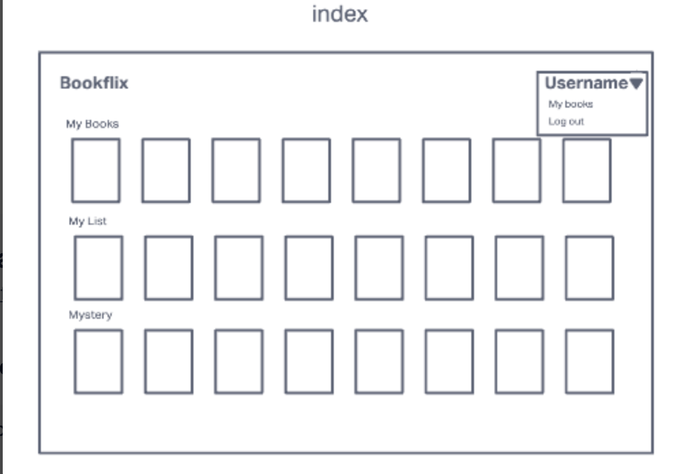

# The Record Sleeve

## Introduction

The Record Sleeve is a music app that allows users to access existing record's information from the library and search the last.FM API for additional records that they can add to their own personal album list - Including cover, description, publishing date, etc.

## Technologies Used

- Python
- Heroku
- Django
- PostgresSQL
- Tailwind CSS
- Last FM API

## Screenshots

## Getting Started

[Click here](https://the-record-sleeve.herokuapp.com/) to launch The Record Sleeve

## Unsolved Problems

- Error handling around API requests, confirmation to save the album after you search, ghosting on the requests that creates random object, error messages during sign-up

## Future Ehancements

- Adjusting unsolved problems

## Trello Board Link

[Click here](https://trello.com/b/spBBIcQS/bookflix)

## Pitch-Deck Link

[Click here](https://docs.google.com/presentation/d/1YlR2KvDFdPw9K9s1T3NY2ZlANrS7gB14na8eWcAtaMc/edit#slide=id.g15b331459d1_2_10)
